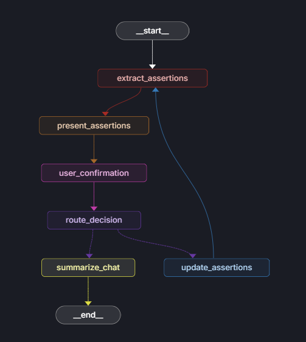
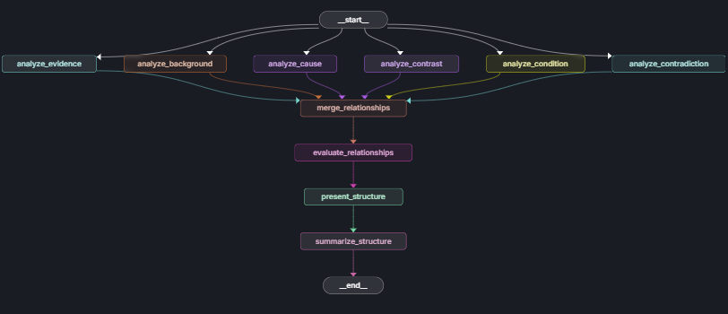
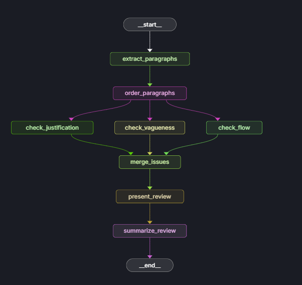
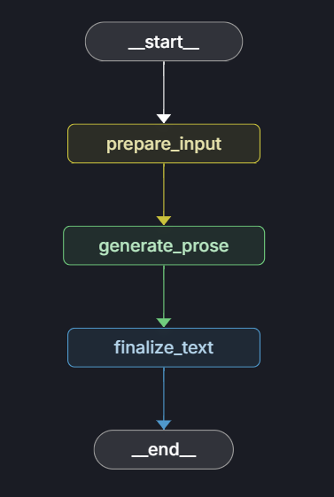

# Clarus
Clarus is more than a tool — it introduces a new paradigm for technical writing. Instead ofworking directly with prose, users interact with the structural essence of their ideas. Everyassertion can be traced back to its origin, whether from dictated speech or an earlierdraft. Text can be regenerated in different styles or formats as needed. The structuredoutline becomes a living source of truth, ready to be reviewed, critiqued, and compiled ondemand.

## Setup

1. **Install dependencies:**
   ```bash
   pip install -r requirements.txt
   ```

2. **Install ffmpeg (for voice features):**
   - **Windows**: Download from [ffmpeg.org](https://ffmpeg.org/download.html) or use chocolatey: `choco install ffmpeg`
   - **macOS**: `brew install ffmpeg`
   - **Linux**: `sudo apt install ffmpeg` (Ubuntu/Debian) or `sudo yum install ffmpeg` (CentOS/RHEL)

3. **Configure environment variables:**
   - Copy `env.example` to `.env`:
     ```bash
     cp env.example .env
     ```
   - Edit `.env` and add your OpenAI API key:
     ```
     OPENAI_API_KEY=your_actual_openai_api_key_here
     ```

4. **Run the application:**
   ```bash
   streamlit run streamlit_app.py
   ```

5. **View workflow diagrams (optional):**
   ```bash
   langgraph dev
   ```
   This will start the LangGraph development server where you can visualize and interact with the workflow diagrams.

## Environment Variables

The application loads environment variables from a `.env` file in the project root. Required variables:

- `OPENAI_API_KEY`: Your OpenAI API key for LLM functionality

## Project Structure

```
Clarus/
├── models/                 # Core data models and state definitions
│   ├── assertions.py      # Assertion data structures
│   └── states.py          # Workflow state management
├── workflows/             # LangGraph workflow implementations
│   ├── idea_capture.py    # Extract assertions from ideas
│   ├── structure.py       # Analyze and organize relationships
│   ├── review.py          # Review and validate content
│   ├── prose.py           # Generate fluent text
│   └── conflict_resolving.py # Handle assertion conflicts
├── ui/                    # Streamlit user interface components
│   ├── idea_ui.py         # Idea capture interface
│   ├── structure_ui.py    # Structure visualization
│   ├── review_ui.py       # Review and editing interface
│   ├── prose_ui.py        # Prose generation interface
│   └── common.py          # Shared UI components
├── voice/                 # Voice input functionality
│   └── streamlit_voice.py # Voice-to-text integration
├── streamlit_app.py       # Main application entry point
├── app.py                 # Alternative Flask app (if needed)
└── langgraph.json         # LangGraph configuration
```

## Workflow Modes

Clarus operates through four distinct workflow modes, each designed for a specific aspect of structured writing:

### 💡 Idea Capture
Extract structured assertions from your thoughts and ideas through voice or text input.



### 🏗️ Structure
Analyze and organize relationships between assertions to create a coherent structure.



### 🔍 Review
Transform assertions into structured paragraphs with comprehensive issue detection.



### 📖 Prose
Generate fluent, well-structured text from your organized content.



## Features

- **💡 Idea Capture**: Extract structured assertions from your thoughts and ideas
- **🏗️ Structure**: Organize and visualize relationships between assertions
- **🔍 Review**: Transform assertions into structured paragraphs with issue detection
- **📖 Prose**: Generate fluent text from structured content
- **🎤 Voice Input**: Dictate your ideas using voice-to-text (requires ffmpeg)

## Dependencies

The application uses a minimal set of dependencies:
- **Core**: LangGraph, LangChain, Streamlit
- **AI**: OpenAI API integration
- **Voice**: Faster-Whisper, Vosk (optional)
- **Visualization**: NetworkX, Plotly